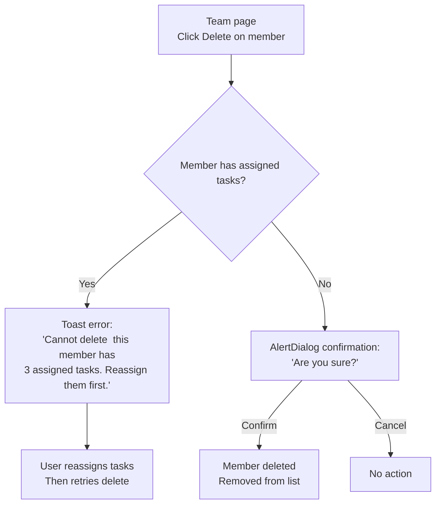

# UX Design Specification TaskFlow

**Author:** parth
**Date:** 2026-02-16

---

<!-- UX design content will be appended sequentially through collaborative workflow steps -->

## Executive Summary

### Project Vision

TaskFlow is a lightweight, blocker-first desktop task management application for a 6-person strategic DevOps team at AIG. It replaces Excel-based tracking with a purpose-built tool that makes blocked tasks impossible to miss, captures daily progress without overhead, and gives the team lead full visibility in 30 seconds. Packaged as a portable Windows Electron app, it lives on the desktop -- never lost in browser tabs.

The existing UI (React + shadcn/ui + Tailwind) already provides functional pages for Dashboard, Task Detail, Team, and Settings with a mock API. This UX specification refines and enhances the established patterns rather than redesigning from scratch.

### Target Users

**Primary: DevOps Engineers (6 people)**
- Technical users (cloud platforms, scripting, infrastructure)
- Interrupt-driven workflow with frequent context switching
- Need a personal task dashboard, not a compliance tool
- Pain: tasks get lost, blockers go unnoticed, Excel updates feel like busywork
- Success signal: engineers update TaskFlow unprompted because it helps *them*

**Primary: DevOps Team Lead (1 person)**
- Manages assignments, prioritization, unblocking, and upward reporting
- Currently spends ~50% of time on management overhead
- Runs daily standups from the dashboard
- Pain: no real-time team visibility, blockers discovered too late, manual status consolidation
- Success signal: full team picture in 30 seconds, standup time cut in half

**Secondary: Project Managers & Dev Teams (indirect)**
- Benefit from faster, data-backed status updates from the lead
- No direct access to TaskFlow needed

### Key Design Challenges

1. **Blocker visibility at scale** -- Blocked tasks must remain unmissable even in a dense 500-task grid. Visual hierarchy (red borders, prominent reasons) must hold at every density level.

2. **Zero-friction daily updates** -- If logging progress feels like work, adoption dies. The update flow must be minimal-click and fast enough that engineers do it willingly, not because they're told to.

3. **Dashboard as standup driver** -- The lead uses the dashboard to run team standups. It must support quick person-by-person walkthroughs, surface recent changes, and allow instant GEAR ID lookups for stakeholder questions.

4. **Desktop-native feel** -- As an always-on desktop app alongside native tools, TaskFlow must feel fast, purposeful, and lightweight -- not like a browser tab. Foundational patterns should support keyboard shortcuts and rapid navigation.

### Design Opportunities

1. **Blocker Review mode** -- A dedicated view surfacing all blocked tasks with reasons, age, and assignee in a scannable format. Purpose-built for the lead's morning review and the product's competitive moat.

2. **Standup-ready grouping** -- Task views grouped by assignee with recent activity summaries, enabling the lead to walk through each person's section without manual filter toggling.

3. **Status-at-a-glance summary** -- A compact status bar (e.g., "4 In Progress, 1 Blocked, 3 To Do, 2 Done") above the task grid providing instant team health without counting cards.

## Core User Experience

### Defining Experience

The core TaskFlow experience is **dashboard-centric**. Both primary user types -- engineers and the team lead -- start and end their day on the dashboard. For engineers, it's a personal task list that shows what to work on, what's blocked, and what's done. For the lead, it's a team health monitor that surfaces problems and enables instant status reporting.

The defining interaction is the **dashboard scan**: open the app, understand the full picture, act on what matters. If this scan takes more than 30 seconds, the product has failed its core promise.

The secondary defining interaction is the **daily update flow**: engineers log progress as a quick personal note, not a formal report. This flow must be fast enough that it feels easier than *not* doing it.

### Platform Strategy

- **Platform:** Windows 10/11 desktop application (Electron shell)
- **Input:** Mouse and keyboard (no touch optimization required)
- **Display:** Minimum 1024x600, optimized for 1280x800+
- **Connectivity:** Always-online enterprise environment; no offline mode
- **Distribution:** Portable executable, no installer, no admin privileges
- **Desktop integration:** Taskbar presence only -- no system tray, no notifications, no startup launch
- **Performance expectations:** Launch <5s, task list load <2s, interactions <200ms
- **Keyboard navigation:** Foundational patterns must be keyboard-accessible; dedicated shortcuts planned for v1.1

### Effortless Interactions

| Interaction | Target Experience |
|---|---|
| Dashboard scan | Open app, see full team status -- zero clicks to understand health |
| Blocker marking | Status change + reason = automatic visual escalation (red border, prominent reason) |
| Daily update | Quick note entry, minimal fields, fast save -- feels like jotting a personal note |
| GEAR ID lookup | Type 4 digits, get instant results -- answer PM questions in <30 seconds |
| Filtering/sorting | Instant client-side response, no perceived loading |
| Task creation | Modal with smart defaults -- only title is truly required to start |
| Sub-task checkoff | Single click toggle, immediate visual progress update |

### Critical Success Moments

1. **First dashboard load** -- Lead sees full team picture in one glance. Instant and clear or the product fails.
2. **First blocker marked** -- Engineer sets Blocked status, card turns red immediately. Lead proactively reaches out. The "aha" moment.
3. **First standup on TaskFlow** -- Meeting runs in half the time. Lead asks "what do you need?" not "what are you working on?"
4. **First new member onboarding** -- New engineer opens app, sees assigned tasks, logs first update. Zero training needed.
5. **First PM question answered** -- Lead searches GEAR ID, gets full task context, responds in under 30 seconds.

### Experience Principles

1. **Blockers scream, everything else hums.** The visual hierarchy is opinionated: blocked tasks dominate attention with red borders and prominent reasons. Everything else is clean and quiet. This dashboard has a point of view.

2. **30-second clarity.** Any user should understand team status within 30 seconds of opening the app. No drilling down, no clicking through, no mental assembly required.

3. **Log, don't report.** Daily updates feel like jotting a note to yourself, not writing a status report for your boss. The language, interaction speed, and minimal fields are all optimized for personal usefulness.

4. **Respect the engineer's time.** Every interaction justifies its existence. If a click doesn't serve the user, remove it. If a field isn't needed, hide it. The app earns its place on the taskbar by saving more time than it costs.

5. **Desktop-native confidence.** Fast transitions, no loading spinners for local operations, instant filter responses. The app feels as responsive as a native tool, not a web page.

## Desired Emotional Response

### Primary Emotional Goals

| User | Primary Emotion | Description |
|---|---|---|
| Engineers | **In control and unburdened** | TaskFlow feels like a clean desk -- you know exactly what's on your plate, what's next, and when something's stuck, the right people already know. Never feels like a chore or surveillance. |
| Team Lead | **Confident and relieved** | Nothing is slipping through the cracks. No need to chase people for updates or reconstruct status from fragments. Walking into standup already knowing every answer. |
| Both | **Clarity** | The defining emotional differentiator. You open the app, you know. No anxiety about what you're missing, no overwhelm from noise. Just clear signal. |

### Emotional Journey Mapping

| Stage | Desired Feeling | Anti-Pattern to Avoid |
|---|---|---|
| **First launch** | Immediate orientation -- "I already know how this works" | Confusion, blank-screen anxiety, tutorial fatigue |
| **Daily open** | Quiet confidence -- "I know what my day looks like" | Dread of a notification avalanche or wall of unread items |
| **Logging an update** | Quick satisfaction -- "Done, that took 10 seconds" | Obligation, form-filling tedium, "do I really have to?" |
| **Marking a blocker** | Relief -- "Now someone will see this without me chasing" | Guilt about flagging problems, fear of visibility |
| **Scanning dashboard (lead)** | Command -- "I see everything, nothing is hidden" | Anxiety that the picture is incomplete, distrust of the data |
| **Something goes wrong** | Guided composure -- "I know what happened and what to do" | Panic, cryptic errors, lost work, dead ends |
| **Returning next day** | Familiarity -- "Everything is where I left it" | Disorientation, stale data confusion, context loss |

### Micro-Emotions

**Critical emotional states to cultivate:**
- **Confidence over confusion** -- Every screen immediately communicates what it is and what to do. No ambiguous states, no mystery icons.
- **Trust over skepticism** -- Data is always current. Timestamps prove freshness. The dashboard reflects reality, not a stale snapshot.
- **Accomplishment over frustration** -- Checking off sub-tasks, moving tasks to Done, seeing the progress bar fill -- these small moments of completion compound into daily satisfaction.
- **Calm over anxiety** -- The blocker system means problems are visible *to everyone*, removing the individual burden of escalation. The system does the worrying for you.

**Emotional states to actively prevent:**
- **Surveillance anxiety** -- Engineers must never feel monitored or judged by their update frequency. The tool serves *them* first.
- **Update fatigue** -- Daily updates should never feel like a mandatory report. Language and interaction design must reinforce "quick note" framing.
- **Information overload** -- The dashboard must filter and prioritize, not dump everything. Status summary and smart defaults prevent cognitive overwhelm.

### Design Implications

| Emotional Goal | UX Design Approach |
|---|---|
| Clarity | Clean visual hierarchy -- blockers dominate, everything else recedes. Generous whitespace. No visual clutter. |
| In control | Persistent filters, predictable layouts, instant responses. User always knows where they are and how to get back. |
| Unburdened | Minimal required fields (only title to create a task). Smart defaults. Auto-clear blocking reason on status change. |
| Quick satisfaction | Micro-animations on state changes (checkbox check, progress bar fill, status badge update). Immediate visual feedback. |
| Relief (blocker marking) | Status change + reason = done. No extra confirmation dialogs. The red border appears instantly as positive reinforcement that the system is working. |
| Guided composure (errors) | Error messages are specific, actionable, and never blame the user. "Unable to connect -- check Settings" not "Error 500". |
| Trust | Relative timestamps ("2 hours ago"), last-updated indicators, real-time filter counts. The data proves it's alive. |

### Emotional Design Principles

1. **Clarity is the product.** Every design decision is evaluated against: "Does this make the user's mental model clearer or muddier?" If muddier, cut it.

2. **Serve the individual first, the team second.** Engineers must feel TaskFlow helps *them* before it helps the lead. Personal dashboard feel > reporting tool feel. This drives voluntary adoption.

3. **Make the right thing effortless, the wrong thing impossible.** Blocked status requires a reason (you can't forget). Status change clears the reason (you can't leave stale data). Smart constraints that feel helpful, not restrictive.

4. **Small completions compound.** Sub-task checkoffs, progress bars filling, status transitions -- design these micro-moments to feel satisfying. They're the dopamine loop that drives daily engagement.

5. **Errors are conversations, not dead ends.** Every error state offers a next step. Connection failed? Here's the Settings link. Can't delete a member? Here's why and what to do. The app never leaves the user stranded.

## UX Pattern Analysis & Inspiration

> **Implementation Note:** The existing `taskflow-ui/` codebase (built by Lovable AI) is the baseline. All recommendations in this specification explicitly distinguish between **Keep as-is** (existing patterns that work), **Modify** (specific changes to existing components with file references), and **Add new** (net-new components). Every change references the actual source files in `taskflow-ui/src/` where modifications apply.

### Inspiring Products Analysis

**1. Linear (linear.app) -- Engineering-grade task management**

Linear is the closest UX parallel to TaskFlow's ambitions. Built explicitly for engineering teams who found Jira too heavy, it proves that speed and opinionation beat flexibility and configuration for small technical teams.

| Aspect | What Linear Does Well | Lesson for TaskFlow |
|---|---|---|
| Performance | Every interaction feels instant -- filters, navigation, status changes happen with zero perceived latency | TaskFlow must match this. Client-side filtering on loaded data, optimistic UI updates, no spinners for local operations. |
| Visual hierarchy | Status-driven color coding, clean information density, generous whitespace between semantic groups | Validate the existing card grid approach but ensure blocked tasks break the visual rhythm more aggressively than Linear's approach. |
| Creation friction | Cmd+I to create, title-first, everything else optional and fillable later | TaskFlow's modal is heavier -- consider whether the "title only to start" principle is aggressive enough. |
| Keyboard-first | Every action reachable via keyboard, command palette for power users | Foundation for v1.1 shortcuts. Ensure tab order and focus management are correct from day one. |

**2. GitHub Issues/Projects -- Developer-native mental model**

GitHub's task tracking maps directly to the mental model TaskFlow's users already have. Issues, status, assignees, labels -- the vocabulary is identical.

| Aspect | What GitHub Does Well | Lesson for TaskFlow |
|---|---|---|
| Minimal creation | Title + submit = done. Description, labels, assignee all optional and addable later | Reinforces the "only title is required" principle. Don't gate creation on filling out a full form. |
| Inline editing | Status changes, label additions, and assignee changes happen without opening a separate edit view | TaskFlow's current pattern (open modal to edit) adds friction. Consider inline status changes on cards for v1. |
| Badge system | Color-coded labels and status badges are scannable at a glance in list views | Validates TaskFlow's existing badge approach for status/priority/GEAR ID. Keep badges small, color-coded, and consistent. |
| Markdown updates | Comments/updates are plain text with markdown -- no rich text editor overhead | TaskFlow's daily updates should stay as simple textarea, not a rich text editor. Plain text is faster. |

**3. Slack -- "Quick glance, quick action" interaction cadence**

Not a task tool, but the interaction pattern matters. Engineers check Slack reflexively throughout the day. TaskFlow needs that same quick-check habit loop.

| Aspect | What Slack Does Well | Lesson for TaskFlow |
|---|---|---|
| What-changed signals | Bold text, unread indicators, and badges surface what's new since last visit | TaskFlow should make "what changed" visible -- relative timestamps ("2 hours ago"), recently updated tasks surfaced via sort. |
| Urgency hierarchy | Red badges for mentions, bold for unread channels -- visual urgency is tiered | Maps directly to TaskFlow's blocker-first hierarchy. Blocked = red (urgent), In Progress = blue (active), To Do = gray (ambient). |
| Quick reply | Reply without opening a full conversation -- inline, fast, minimal | Daily updates should aspire to this speed. The fewer clicks between "I want to log progress" and "done," the better. |
| Persistent navigation | Sidebar always visible, current context always clear | TaskFlow's top header nav serves this role. Always visible, always showing where you are. |

### Transferable UX Patterns

**Navigation Patterns:**
- **Persistent top nav with active state** (Slack/Linear) -- TaskFlow already has this via `Header.tsx`. **Keep as-is.**
- **Filter persistence** (Linear) -- Active filters should persist across navigation and sessions, so users don't re-apply them every time. **Add new** behavior to `Index.tsx`.

**Interaction Patterns:**
- **Title-first quick create** (GitHub) -- Task creation starts with just a title. All other fields optional and defaulted intelligently. **Modify** `TaskFormDialog.tsx` to emphasize title-first flow.
- **Inline status changes** (GitHub/Linear) -- Status transitions directly on cards without opening an edit modal. **Add new** interaction to `TaskCard.tsx`.
- **Optimistic UI updates** (Linear) -- Show the result immediately, sync in background. No waiting for server confirmation on status toggles, sub-task checks, etc. **Modify** data fetching pattern when migrating to TanStack Query.

**Visual Patterns:**
- **Tiered urgency colors** (Slack) -- Three tiers: urgent (red/blocked), active (blue/in-progress), ambient (gray/to-do, green/done). **Keep as-is** -- existing color scheme in `TaskCard.tsx` and `TaskDetail.tsx` already follows this pattern. Extract to shared constants.
- **Information density with breathing room** (Linear) -- Cards show enough info to be useful without feeling cramped. **Keep as-is** -- existing card layout is well-balanced.
- **Relative timestamps** (Slack/GitHub) -- "2 hours ago" is more useful than absolute timestamps. **Keep as-is** -- already implemented via `date-utils.ts` `formatRelativeDate()`.

**Data Patterns:**
- **Badge-based metadata** (GitHub) -- Small, color-coded badges for status, priority, and GEAR ID. **Keep as-is** -- already implemented in `TaskCard.tsx`.
- **Progress indicators** (GitHub) -- Sub-task progress as a thin bar + count. **Keep as-is** -- already implemented in `TaskCard.tsx` with `Progress` component.

### Anti-Patterns to Avoid

| Anti-Pattern | Source | Why It's Wrong for TaskFlow |
|---|---|---|
| **Configuration overhead** | Jira | The team rejected Jira explicitly. Zero setup, zero workflow configuration. The tool is opinionated by design. |
| **Visual flatness** | Excel | Everything looking the same priority = no signal. The exact problem TaskFlow exists to solve. Blocked tasks MUST break the visual rhythm. |
| **Blank-canvas anxiety** | Notion | Too flexible, too many choices. TaskFlow is structured and opinionated -- tasks have fixed fields, not freeform blocks. |
| **Tutorial dependency** | Enterprise tools | If a new team member needs a tutorial, the UX failed. Every interaction should be self-evident. |
| **Heavy edit flows** | Jira | Opening a full-page edit view for a status change is a 10-second detour for a 1-second action. Status changes must be lightweight. |
| **Notification spam** | Slack (ironically) | TaskFlow has no notifications in v1, and that's correct. The dashboard IS the notification -- you check it, you see what's new. |
| **Modal fatigue** | Many apps | Every action behind a modal trains users to dread clicking. Reserve modals for creation/deletion confirmation. Inline editing for frequent actions. |

### Design Inspiration Strategy

**What to Adopt Directly:**
- Linear's performance philosophy -- every interaction feels instant
- GitHub's title-first creation pattern -- minimal barrier to capturing work
- Slack's tiered urgency visual hierarchy -- red/blue/gray mapping to blocked/active/ambient
- Relative timestamps everywhere -- freshness over precision

**What to Adapt for TaskFlow:**
- Linear's keyboard-first approach -- lay the foundation now (tab order, focus management), full shortcuts in v1.1
- GitHub's inline editing -- start with inline status changes on cards; full inline editing can come later
- Slack's "what changed" signals -- use sort-by-recently-updated as default, relative timestamps on cards

**What to Deliberately Avoid:**
- Jira's configurability -- TaskFlow is opinionated, not flexible
- Notion's blank canvas -- structured fields, not freeform
- Any pattern requiring a tutorial or onboarding flow
- Heavy modal workflows for frequent actions (status changes, sub-task toggles)

## Design System Foundation

### Design System Choice

**shadcn/ui + Tailwind CSS + Radix UI** -- already implemented in `taskflow-ui/`.

This is a themeable component system that provides accessible, customizable primitives with full design token control via CSS variables. It was chosen by the initial Lovable scaffold and is the correct choice for TaskFlow -- no change needed.

| Attribute | Current State |
|---|---|
| Component library | shadcn/ui (38 primitives installed, ~15 actively used) |
| Styling engine | Tailwind CSS 3.4 with `tailwindcss-animate` plugin |
| Primitive layer | Radix UI (built-in accessibility, focus management, keyboard support) |
| Variant system | class-variance-authority (CVA) |
| Utility | `cn()` helper via clsx + tailwind-merge (`src/lib/utils.ts`) |
| Icons | lucide-react |
| Config | `components.json` -- style=default, base color=slate, CSS variables=true |
| Design tokens | Full light mode palette in `src/index.css` via CSS custom properties |

### Rationale for Selection

- **Lovable-native:** Lovable AI builds with shadcn/ui natively, ensuring seamless development workflow
- **Single developer + AI:** shadcn/ui's copy-paste component model works perfectly with AI-assisted development -- components are in your codebase, not a node_module black box
- **Accessibility built-in:** Radix primitives provide WCAG-compliant keyboard navigation, focus trapping, and ARIA attributes out of the box
- **Full customization:** CSS variables control the entire palette. Tailwind config extends with semantic tokens. No fighting the framework.
- **Existing momentum:** The codebase already has 38 primitives installed and a working application. Switching would be net-negative.

### Implementation Approach

**Keep as-is -- no design system migration needed.** The existing setup is correct and well-configured.

**Active primitives (used in application code):**
`alert`, `alert-dialog`, `badge`, `button`, `card`, `checkbox`, `dialog`, `input`, `label`, `progress`, `select`, `separator`, `switch`, `textarea`, `toast`/`toaster`, `sonner`, `tooltip`

**Available for future use (installed, not yet used):**
`accordion`, `tabs`, `dropdown-menu`, `popover`, `sheet`, `command`, `table`, `calendar`, `skeleton`, `scroll-area`, `navigation-menu`

**Not needed (candidates for removal to reduce codebase size):**
`aspect-ratio`, `carousel`, `chart`, `collapsible`, `context-menu`, `drawer`, `form`, `hover-card`, `input-otp`, `menubar`, `pagination`, `radio-group`, `resizable`, `slider`, `toggle`, `toggle-group`

### Customization Strategy

**Current design tokens (light mode only -- dark mode is out of scope for v1):**

| Token | Value | Usage |
|---|---|---|
| `--background` | `0 0% 100%` (white) | Page background |
| `--foreground` | `222.2 84% 4.9%` (near-black) | Primary text |
| `--primary` | `222.2 47.4% 11.2%` (dark navy) | Buttons, links, accents |
| `--secondary` | `210 40% 96.1%` (light blue-gray) | Secondary surfaces |
| `--muted` | `210 40% 96.1%` | Disabled states, placeholders |
| `--destructive` | `0 84.2% 60.2%` (red) | Delete actions, errors |
| `--border` | `214.3 31.8% 91.4%` (light blue-gray) | Card and input borders |
| `--radius` | `0.5rem` | Border radius base |

**Status/priority semantic colors (hardcoded, not yet tokenized):**

| Semantic | Light BG | Text | Border | Used For |
|---|---|---|---|---|
| Blocked/High | `red-100` | `red-700` | `red-200` | Blocked status, High priority |
| In Progress/Active | `blue-100` | `blue-700` | `blue-200` | In Progress status, Low priority |
| Medium | `yellow-100` | `yellow-700` | `yellow-200` | Medium priority |
| Done | `green-100` | `green-700` | `green-200` | Done status |
| To Do | `gray-100` | `gray-700` | `gray-200` | To Do status |

### Codebase Cleanup Items

The following cleanup tasks should be addressed. Each is a discrete Lovable prompt:

**1. Extract shared color constants** `[Modify]`
- **Files:** `src/components/TaskCard.tsx`, `src/pages/TaskDetail.tsx`
- **Issue:** `priorityStyles` and `statusStyles` objects are duplicated in both files
- **Action:** Create `src/lib/constants.ts` with shared `STATUS_STYLES` and `PRIORITY_STYLES` maps. Import in both components.
- **Why:** Single source of truth for color coding; prevents drift as new statuses or priorities are added.

**2. Remove dead code** `[Modify]`
- **File:** `src/App.css` -- Contains only Vite starter logo animation CSS. Imported in `main.tsx` but has zero effect on the app.
- **Action:** Delete `App.css` and remove its import from `main.tsx`.
- **File:** `src/components/NavLink.tsx` -- Defined but never used. `Header.tsx` uses `Link` + `useLocation` directly.
- **Action:** Delete `NavLink.tsx`.

**3. Remove dark mode artifacts** `[Modify]`
- **File:** `src/index.css` -- Contains a full `.dark` class CSS variable block that will never be used in v1.
- **File:** `tailwind.config.ts` -- Has `darkMode: ["class"]` configured.
- **Action:** Remove the `.dark` block from `index.css`. Remove `darkMode` config from `tailwind.config.ts`. Remove `next-themes` dependency from `package.json`. Remove the `Sonner` `toaster` that references `useTheme` from `App.tsx` (keep the Radix `Toaster` which is the one actually used).
- **Why:** Reduces confusion about supported features. Can be re-added cleanly when dark mode is scoped.

**4. Remove unused sidebar component** `[Modify]`
- **File:** `src/components/ui/sidebar.tsx` -- Full-featured collapsible sidebar with cookie persistence, keyboard shortcut, and mobile sheet. Never used -- app uses top `Header` nav.
- **Action:** Delete `sidebar.tsx`. Remove sidebar-specific CSS tokens from `index.css` (8 `--sidebar-*` variables). Remove sidebar color mappings from `tailwind.config.ts`.
- **Why:** Dead code that adds confusion. If a sidebar is needed later, it can be re-added from shadcn/ui.

**5. Consolidate toast system** `[Modify]`
- **Files:** `src/App.tsx`, `src/components/ui/sonner.tsx`, `src/components/ui/toaster.tsx`
- **Issue:** Both Radix `Toaster` and `Sonner` are mounted in `App.tsx`. Only the Radix `useToast` hook is used in application code.
- **Action:** Remove `Sonner` component from `App.tsx`. Delete `src/components/ui/sonner.tsx`. Remove `sonner` dependency from `package.json`.
- **Why:** Single toast system reduces confusion and bundle size.

**6. Remove unused shadcn primitives** `[Optional/Low Priority]`
- **Files:** 16 component files in `src/components/ui/` (listed in "Not needed" above)
- **Action:** Delete unused primitive files that are unlikely to be needed for v1 features.
- **Why:** Reduces codebase size and cognitive overhead when navigating the project. Can be re-added via `npx shadcn@latest add <component>` if needed.

## Defining Experience

### The One-Liner

**"Open, scan, act."** -- Open the app, see everything that matters in one glance, act on what needs attention.

The interaction users describe to a peer: *"I open TaskFlow and immediately see what's blocked, what's in progress, and who needs help. No setup, no clicking through, just a clear picture."*

This is an established pattern (dashboard + card grid + filters) with one novel twist: **blocker-first visual hierarchy**. TaskFlow doesn't treat all statuses equally -- it's opinionated about what matters most. The red-bordered blocked tasks breaking the visual rhythm IS the product innovation.

### User Mental Model

**Mental model migration from Excel:**

| Excel Mental Model | TaskFlow Equivalent | Friction Reduction |
|---|---|---|
| Rows in a spreadsheet, manually colored | Task cards with automatic color coding | No manual formatting -- status drives visuals |
| Scroll through 100 rows to find blocked items | Red-bordered cards jump off the screen, or filter to Blocked | Seconds instead of minutes |
| Ctrl+F to search for a GEAR ID | Search bar + GEAR ID filter on dashboard | Same intent, better execution |
| Ask each person "what are you working on?" | Filter by assignee, read daily updates | Self-service, no chasing |
| Color a cell red when something's blocked | Set status to Blocked + reason, red border appears automatically | The system does the visual work |
| Copy-paste status into an email for the PM | Screenshot the dashboard or filter by GEAR ID | 30 seconds vs. 20 minutes |

**Key mental model assumptions:**
- Engineers think in "my tasks" and "team tasks" -- the assignee filter is intuitive
- Status is a 4-value enum, not a freeform field -- this matches how the team already talks about work ("it's blocked," "it's done")
- GEAR ID is a lookup key they already use in Excel -- same vocabulary, same 4-digit format
- Daily updates replace the "what did you do yesterday?" standup question -- same information, captured asynchronously

### Success Criteria

| Criteria | Metric | How We'll Know |
|---|---|---|
| **Instant comprehension** | Team status understood in <30 seconds | Lead opens app before standup, doesn't need to click into any task to know the state of the team |
| **Blocker unmissability** | Zero blocked tasks go unnoticed for >4 hours | Red borders + prominent blocking reasons make it physically impossible to miss a blocked task on the dashboard |
| **Update effortlessness** | Daily updates logged in <15 seconds | Engineer clicks Add Update, types a sentence, hits save. No author selection needed if we can infer from context. |
| **Zero-training onboarding** | New member productive in <5 minutes | Priya opens the app, sees her tasks, checks off a sub-task, logs an update -- no tutorial, no walkthrough |
| **Filter speed** | Any filter combination applied in <500ms | Client-side filtering on loaded data. No loading spinner, no server round-trip for filter changes. |
| **Stakeholder response** | PM question answered in <30 seconds | Lead types GEAR ID in search, gets full task context, responds immediately |

### Novel UX Patterns

**Pattern type: Established with one novel twist.**

**Established patterns (keep, don't reinvent):**
- Card grid dashboard with filters and sort -- proven by Linear, GitHub Projects, Trello
- Modal-based task creation -- familiar from every project management tool
- Checklist sub-tasks with progress bar -- GitHub Issues pattern
- Reverse-chronological update log -- Slack/GitHub comment pattern
- Top navigation with active state -- universal web app pattern

**The novel twist: Blocker-first visual hierarchy** `[Keep as-is in existing implementation]`

The dashboard has a point of view. Unlike tools that treat all statuses equally (Trello's columns, Jira's board), TaskFlow's grid is visually opinionated:

- **Blocked tasks** get a 3px red border (`border-[3px] border-red-500`), an AlertTriangle icon, and the blocking reason displayed directly on the card. They break the visual rhythm. You can't not see them.
- **Everything else** is visually quiet -- clean borders, subtle color-coded badges, consistent card height.

This asymmetry is intentional and must be preserved. It's what makes TaskFlow different from "another card board."

**Existing implementation status:**
- `TaskCard.tsx`: Blocked treatment already implemented -- red border, AlertTriangle icon, truncated blocking reason. **Keep as-is.**
- `TaskDetail.tsx`: Blocked banner with red border and full blocking reason. **Keep as-is.**
- `TaskFormDialog.tsx`: Blocking reason field appears conditionally when status is Blocked, with red highlight. **Keep as-is.**

### Experience Mechanics

#### Flow 1: The Dashboard Scan (Lead -- Morning Routine)

**1. Initiation:**
- Lead launches TaskFlow (or switches to it from taskbar). Dashboard (`/`) loads as the default route.
- **Current:** `Index.tsx` loads tasks + members in parallel via `useEffect`. Shows `Loader2` spinner during load. **Keep as-is** for mock; optimize for real API with TanStack Query.

**2. Interaction:**
- Lead sees the card grid. Eyes are immediately drawn to any red-bordered blocked cards.
- Lead scans status summary (**Add new** -- status count bar above the grid, not yet implemented).
- Lead optionally filters by assignee to prepare for person-by-person standup walkthrough.
- **Current:** Filters exist for status, priority, assignee, and search. Sort by Recently Updated, Priority, or Status. **Keep as-is.**

**3. Feedback:**
- Filter counts update instantly (client-side `useMemo` in `Index.tsx`). **Keep as-is.**
- Relative timestamps on cards ("2 hours ago") confirm data freshness. **Keep as-is** via `formatRelativeDate()`.
- Empty state messages differentiate "no tasks" from "no filter matches." **Keep as-is.**

**4. Completion:**
- Lead has full team picture. Clicks into a blocked task to read the full reason, or starts standup with the dashboard visible.
- **No explicit "done" state** -- this is a continuous monitoring flow, not a task-completion flow.

#### Flow 2: Logging a Daily Update (Engineer -- Throughout the Day)

**1. Initiation:**
- Engineer clicks into their task from dashboard (navigates to `/tasks/:id`).
- Scrolls to Daily Updates section.
- Clicks "Add Daily Update" button.
- **Current:** Opens a Dialog with author select dropdown + textarea. **Modify** -- see below.

**2. Interaction:**
- Engineer types their update (max 1000 chars).
- **Current pain point:** Engineer must select themselves from the author dropdown every time. This adds friction to a flow that should be effortless.
- **Recommended modification to `TaskDetail.tsx`:** If there's only one logged-in user context (v1 has no auth, so this is deferred), pre-select the author. For v1, at minimum remember the last-selected author in localStorage so it doesn't reset on every dialog open. `[Modify]`

**3. Feedback:**
- Update appears at top of the list immediately after save.
- Toast confirmation: "Update added." **Keep as-is.**
- "(edited)" label appears if modified within 24 hours. **Keep as-is.**

**4. Completion:**
- Update is saved. Engineer closes the dialog and continues working. Total time: <15 seconds.

#### Flow 3: Marking a Task as Blocked (Engineer -- When Stuck)

**1. Initiation:**
- Engineer is on task detail view (`/tasks/:id`).
- Clicks Edit button, opening `TaskFormDialog` in edit mode.
- **Current:** Full edit modal opens. **Keep as-is for v1.** Future enhancement: inline status change on dashboard cards to skip the modal entirely.

**2. Interaction:**
- Engineer changes Status dropdown to "Blocked."
- Blocking Reason textarea appears with red highlight (`border-red-300 bg-red-50`). **Keep as-is.**
- Engineer types the blocking reason.
- Clicks Save.

**3. Feedback:**
- Task card on dashboard immediately shows red border + blocking reason. **Keep as-is.**
- Toast confirmation: "Task updated." **Keep as-is.**
- If engineer tries to save Blocked without a reason, inline validation error appears. **Keep as-is.**

**4. Completion:**
- The blocked task is now visible to everyone on the dashboard. The engineer doesn't need to send a message, file a ticket, or chase the lead. The system does the escalation through visual design.

#### Flow 4: Quick Task Creation (Lead -- Capturing Ad-hoc Work)

**1. Initiation:**
- Lead clicks "New Task" button on dashboard.
- `TaskFormDialog` opens in create mode.
- **Current:** All fields visible immediately. **Keep as-is** -- the modal is not overly heavy for creation.

**2. Interaction:**
- Lead types title (required).
- Optionally sets: assignee, priority, status, GEAR ID, description.
- Smart defaults: Status = "To Do", Priority = "Medium", Assignee = "Unassigned."
- **Current:** All defaults are correct. **Keep as-is.**

**3. Feedback:**
- Inline validation: title required, GEAR ID must be 4 digits. **Keep as-is.**
- Loading spinner on save button. **Keep as-is.**
- Toast: "Task created." **Keep as-is.**

**4. Completion:**
- New task appears in dashboard grid. Lead can immediately assign it or leave it for later triage.

## Visual Design Foundation

### Color System

**Approach: Keep existing palette as-is.** The current slate/navy color system in `src/index.css` is professional, utilitarian, and appropriate for an internal DevOps tool. No brand guidelines to conform to -- the codebase IS the brand.

**Core palette (from CSS custom properties in `src/index.css`):** `[Keep as-is]`

| Role | Token | Value | Visual |
|---|---|---|---|
| Background | `--background` | `hsl(0 0% 100%)` | White |
| Foreground | `--foreground` | `hsl(222.2 84% 4.9%)` | Near-black |
| Primary | `--primary` | `hsl(222.2 47.4% 11.2%)` | Dark navy |
| Primary foreground | `--primary-foreground` | `hsl(210 40% 98%)` | Near-white |
| Secondary | `--secondary` | `hsl(210 40% 96.1%)` | Light blue-gray |
| Muted | `--muted` | `hsl(210 40% 96.1%)` | Light blue-gray |
| Muted foreground | `--muted-foreground` | `hsl(215.4 16.3% 46.9%)` | Medium gray |
| Accent | `--accent` | `hsl(210 40% 96.1%)` | Light blue-gray |
| Destructive | `--destructive` | `hsl(0 84.2% 60.2%)` | Red |
| Border | `--border` | `hsl(214.3 31.8% 91.4%)` | Light blue-gray |
| Ring | `--ring` | `hsl(222.2 84% 4.9%)` | Near-black |

**Semantic status/priority colors (hardcoded in components):** `[Modify -- extract to shared constants]`

| Semantic | Background | Text | Border | Usage |
|---|---|---|---|---|
| Blocked / High Priority | `red-100` | `red-700` | `red-200` | The loudest color in the system. Reserved for things that need immediate attention. |
| In Progress | `blue-100` | `blue-700` | `blue-200` | Active work. Calm but visible. |
| Medium Priority | `yellow-100` | `yellow-700` | `yellow-200` | Moderate urgency. Warm without alarm. |
| Done | `green-100` | `green-700` | `green-200` | Completed. Satisfying, recedes from attention. |
| To Do / Low Priority | `gray-100` | `gray-700` | `gray-200` | Ambient. Waiting to be picked up. Quietest in the hierarchy. |

**Color hierarchy principle:** The color system is intentionally asymmetric. Red dominates (blockers scream), blue and yellow provide moderate signal (active/medium), green and gray recede (done/to-do). This supports the "blockers scream, everything else hums" experience principle.

**Blocked task special treatment:** `[Keep as-is]`
- Card border: `border-[3px] border-red-500` (3px vs default 1px -- visually breaks the grid rhythm)
- Blocking reason inset: `bg-red-50 border border-red-200` with `AlertTriangle` icon
- Task detail banner: `border-2 border-red-300 bg-red-50`
- Form field: `border-red-300 bg-red-50` on blocking reason textarea when status is Blocked

### Typography System

**Approach: Keep existing system as-is.** The codebase uses Tailwind's default font stack with shadcn/ui's typography conventions. No custom fonts needed for an internal tool.

**Font stack:** `[Keep as-is]`
- **Primary (sans-serif):** Tailwind default -- `ui-sans-serif, system-ui, -apple-system, BlinkMacSystemFont, "Segoe UI", Roboto, "Helvetica Neue", Arial, sans-serif`
- **Monospace:** Tailwind default -- used for GEAR IDs (`font-mono` class in `TaskCard.tsx`)
- **Rationale:** System fonts ensure fastest load time, native feel on Windows, and zero font-loading flicker. Perfect for a desktop app that should feel native.

**Type scale (from existing usage patterns):**

| Element | Size | Weight | Usage |
|---|---|---|---|
| Page title | `text-2xl` (24px) | `font-bold` | "Task Dashboard", "Team Members" |
| Section heading | `text-xl` (20px) | `font-semibold` | "Sub-tasks", "Daily Updates" |
| Card title | `text-base` (16px) | `font-semibold` | Task titles on cards (2-line clamp) |
| Body text | `text-sm` (14px) | `font-normal` | Descriptions, update content, form labels |
| Badge text | `text-[10px]`-`text-[11px]` | `font-medium` | Status/priority/GEAR ID badges |
| Muted/secondary | `text-sm` (14px) | `font-normal` + `text-muted-foreground` | Timestamps, helper text, empty states |
| Monospace | `text-xs` (12px) | `font-mono` | GEAR ID display |

**Typography principles:**
- **No custom fonts.** System fonts = native feel + zero load time.
- **Size communicates hierarchy.** Larger = more important. No exceptions.
- **Weight communicates actionability.** Bold/semibold = headings and interactive elements. Normal = read-only content.
- **Muted foreground for secondary info.** Timestamps, helper text, and metadata use `text-muted-foreground` to recede from primary content.

### Spacing & Layout Foundation

**Approach: Keep existing Tailwind spacing system.** The codebase uses Tailwind's 4px base unit consistently.

**Spacing scale (from existing usage):** `[Keep as-is]`

| Token | Value | Usage |
|---|---|---|
| `gap-4` | 16px | Grid gap between task cards |
| `py-6` | 24px | Main content vertical padding |
| `space-y-6` | 24px | Vertical spacing between page sections |
| `space-y-4` | 16px | Spacing between form fields, list items |
| `space-y-2` | 8px | Tight spacing within groups (label + input) |
| `p-4` / `p-6` | 16px / 24px | Card internal padding |
| `px-2 py-0.5` | 8px / 2px | Badge padding |

**Layout system:** `[Keep as-is]`

| Pattern | Implementation | Usage |
|---|---|---|
| Page container | `container py-6 space-y-6` | All pages -- centered, max-width `2xl` (1400px), 2rem padding |
| Content constraint | `max-w-3xl` or `max-w-xl` | Detail/settings pages -- narrower for readability |
| Card grid | `grid gap-4 grid-cols-1 md:grid-cols-2 lg:grid-cols-3` | Dashboard and Team pages |
| Sticky header | `sticky top-0 z-40 border-b bg-card` | Top navigation bar |

**Layout principles:**
- **Consistent container pattern.** Every page uses the same `container py-6 space-y-6` wrapper. Predictable, reliable.
- **Responsive grid.** 1 column on small screens, 2 on medium, 3 on large. Already implemented correctly.
- **Content width constraints.** Detail pages use `max-w-3xl` to prevent lines from becoming too wide for comfortable reading. Dashboard uses full width for maximum card visibility.
- **Generous vertical rhythm.** `space-y-6` (24px) between sections provides clear visual grouping without feeling cramped.

**Border radius:** `[Keep as-is]`
- Base: `--radius: 0.5rem` (8px)
- Large: `var(--radius)` = 8px (cards, dialogs)
- Medium: `calc(var(--radius) - 2px)` = 6px (inputs, selects)
- Small: `calc(var(--radius) - 4px)` = 4px (badges, small elements)

### Accessibility Considerations

**Current state: Good foundation from Radix UI, minor gaps.**

**What's already handled:** `[Keep as-is]`
- **Keyboard focus management:** Radix primitives (Dialog, AlertDialog, Select, etc.) handle focus trapping, Escape to close, and Tab navigation automatically.
- **ARIA attributes:** shadcn/ui components include proper `role`, `aria-label`, and `aria-describedby` attributes via Radix.
- **Color contrast:** The slate/navy palette provides strong contrast ratios. Dark navy text (`hsl(222.2 84% 4.9%)`) on white background exceeds WCAG AA (4.5:1 minimum).
- **Focus rings:** `--ring` token used for consistent focus indicator styling.

**Gaps to address:** `[Modify]`

| Gap | Impact | Recommended Action |
|---|---|---|
| Status colors rely on color alone | Color-blind users can't distinguish status by color | Badges already include text labels ("To Do", "Blocked", etc.) which mitigates this. The red border on blocked cards is supplemented by the AlertTriangle icon. **No change needed** -- existing design already uses color + text + icon redundancy. |
| No skip-to-content link | Keyboard users must tab through header on every page | Low priority for a 7-person internal tool. Defer to v1.1 if needed. |
| Minimum window size 1024x600 | Small screen users | Appropriate for desktop-only app. No change needed. |

**Accessibility principle:** Lean on Radix UI's built-in accessibility. Don't add custom ARIA unless Radix doesn't cover the pattern. For a 7-person internal tool, WCAG AA compliance via the component library is sufficient.

## Design Direction Decision

### Design Directions Explored

TaskFlow has an existing, functional UI built by Lovable AI. Rather than generating speculative alternative directions, the design direction decision evaluates the current implementation against the experience principles, emotional goals, and UX patterns established in this specification.

**Evaluation of current UI against experience principles:**

| Principle | Current State | Verdict |
|---|---|---|
| Blockers scream, everything else hums | Red borders, AlertTriangle icon, blocking reason on cards | **Pass** -- well-implemented |
| 30-second clarity | Card grid with filters shows team status quickly | **Partial** -- needs status summary bar for instant counts |
| Log, don't report | Daily updates exist but require author selection each time | **Partial** -- needs friction reduction |
| Respect the engineer's time | Status changes require opening edit modal | **Partial** -- needs inline status change on cards |
| Desktop-native confidence | Client-side filtering is fast, UI is responsive | **Pass** -- good performance characteristics |

### Chosen Direction

**Enhance, don't redesign.** The existing TaskFlow UI is the chosen design direction. The visual foundation, component patterns, and information architecture are correct and validated. The direction is targeted enhancements to close the gaps identified above.

### Design Rationale

1. **The existing UI works.** Four functional pages, consistent patterns, correct visual hierarchy. Redesigning would be net-negative.
2. **Lovable built it.** The development workflow depends on Lovable understanding the codebase. Radical restructuring risks breaking that workflow.
3. **The gaps are specific and small.** A status summary bar, author memory, filter persistence, and inline status changes -- these are discrete, implementable enhancements, not architectural changes.
4. **The blocker treatment is already the product's best feature.** The red border + AlertTriangle + blocking reason pattern is exactly what the product brief called for. Don't touch it.

### Implementation Approach

**Priority-ordered enhancement backlog for Lovable:**

#### Enhancement 1: Status Summary Bar `[Add new]` -- High Priority
- **File:** `src/pages/Index.tsx`
- **What:** Add a compact horizontal bar above the task grid showing status counts: "4 In Progress | 1 Blocked | 3 To Do | 2 Done"
- **Why:** Delivers "30-second clarity" principle. Lead sees team health without counting cards.
- **Implementation notes:**
  - Derive counts from the already-loaded `tasks` array (no additional API call)
  - Use the same color-coded badges as cards (gray/blue/red/green)
  - Clickable counts that apply the corresponding status filter
  - Show total task count: "12 tasks" alongside the breakdown
  - Compact single-line layout, `text-sm`, with `Separator` between status groups

#### Enhancement 2: Inline Status Change on Cards `[Add new]` -- Medium-High Priority
- **File:** `src/components/TaskCard.tsx`
- **What:** Add a small status dropdown (or segmented button group) directly on the task card for quick status transitions
- **Why:** The most common action (status change) currently requires: click card > click Edit > change dropdown > save > close modal. This should be 1 click on the card.
- **Implementation notes:**
  - Use shadcn `Select` or `DropdownMenu` component (both already installed)
  - Position in the card footer area, near the existing status badge
  - When changing to "Blocked," open a small inline input or redirect to the edit modal (blocking reason is required)
  - Optimistic UI update -- show the new status immediately, sync in background
  - Stop click propagation so the status change doesn't navigate to task detail

#### Enhancement 3: Remember Last-Selected Author `[Modify]` -- Medium Priority
- **File:** `src/pages/TaskDetail.tsx`
- **What:** Pre-select the last-used author in the daily update dialog instead of requiring selection every time
- **Why:** Delivers "log, don't report" principle. Removes one unnecessary step from the daily update flow.
- **Implementation notes:**
  - Store `lastSelectedAuthorId` in `localStorage` when a daily update is created
  - On dialog open, pre-select from localStorage if the stored author is still an active member
  - Falls back to no selection if stored author is inactive or not found

#### Enhancement 4: Filter Persistence `[Add new]` -- Medium Priority
- **File:** `src/pages/Index.tsx`
- **What:** Persist dashboard filter state (status, priority, assignee, search, sort) across page navigation and app restarts
- **Why:** Users shouldn't re-apply their preferred filters every time they navigate away and back.
- **Implementation notes:**
  - Store filter state in `localStorage` under a key like `taskflow_dashboard_filters`
  - Load from localStorage on mount, with fallback to default values
  - Clear button resets both UI state and localStorage
  - Sort preference also persisted (default: "Recently Updated")

#### Enhancement 5: Codebase Cleanup `[Modify]` -- Low Priority (do anytime)
- Detailed in the "Codebase Cleanup Items" section of Design System Foundation
- 6 discrete cleanup tasks, each a standalone Lovable prompt
- No user-facing impact, but improves maintainability

## User Journey Flows

### Journey 1: First-Time Setup (Lead)

**Entry:** Lead launches TaskFlow for the first time. Dashboard is empty.

**Flow:**


**UX Notes:**
- **Empty dashboard state** `[Modify]`: Current empty state in `Index.tsx` says "No tasks yet. Create your first task!" -- this is correct for the general case. For true first-launch (no DB connection), the Settings page should be the first destination. **The current Settings page (`SettingsPage.tsx`) shows disabled fields with hardcoded values.** This needs to become functional when the real backend is connected.
- **Settings page error feedback** `[Modify]`: Current `SettingsPage.tsx` is a static placeholder. When made functional, it must show specific error messages: "Connection refused -- is PostgreSQL running?" not just "Connection failed."
- **Team creation flow** `[Keep as-is]`: Current Team page dialog for add/edit works well. No changes needed.

### Journey 2: Engineer Daily Use (Ravi)

**Entry:** Engineer opens TaskFlow from taskbar. Dashboard loads with their tasks visible.

**Flow:**


**UX Notes:**
- **Status summary bar** `[Add new]`: Not yet implemented. First thing the engineer sees -- instant orientation.
- **Assignee filter** `[Keep as-is]`: Already works in `Index.tsx`. Filter by "My Tasks" is the engineer's primary view.
- **Sub-task toggle** `[Keep as-is]`: Single-click checkbox in `TaskDetail.tsx`. Progress bar updates immediately.
- **Daily update flow** `[Modify]`: Pre-select last-used author from localStorage (Enhancement 3 from Design Direction).
- **Inline status change** `[Add new]`: Enhancement 2 from Design Direction. Enables the "blocked" path without opening edit modal (except when blocking reason is needed).

### Journey 3: Monday Standup (Lead)

**Entry:** Lead opens TaskFlow before/during standup. Shares screen with team.

**Flow:**


**UX Notes:**
- **Status summary bar** `[Add new]`: Critical for this journey. Lead glances at counts before saying a word.
- **Blocked task review** `[Keep as-is]`: Red borders already work. Clicking into task detail shows full blocking reason.
- **Assignee filter cycling** `[Keep as-is]`: Select dropdown in `Index.tsx` allows filtering by each team member.
- **GEAR ID search** `[Keep as-is]`: Search input in `Index.tsx` already searches by GEAR ID. Instant client-side filtering.
- **Status change on unblock** `[Keep as-is / Add new]`: Currently requires edit modal. With Enhancement 2 (inline status), lead could change status directly on the card during standup.

### Journey 4: Error Paths (UI-Facing Only)

**Scenario A: Database connection fails on startup**


**UX Notes:**
- **Error banner on dashboard** `[Add new]`: When the real backend is connected and DB is unreachable, `Index.tsx` should show an `Alert` component (already installed) with actionable guidance and a link to Settings. Not yet implemented -- currently the mock API always succeeds.
- **Settings error specificity** `[Modify]`: Error messages must be specific: "Connection refused" vs "Authentication failed" vs "Database not found." The current placeholder Settings page needs real error handling when connected to the backend.

**Scenario B: Deleting a team member with assigned tasks**



**UX Notes:**
- **Delete protection** `[Keep as-is]`: Already implemented in `Team.tsx` and `mock-api.ts`. Toast shows error with assigned task count. Exactly correct.

**Scenario C: Daily update edit/delete after 24 hours**

```mermaid
flowchart TD
    A[Task detail\nDaily update section] --> B{Update age < 24 hours?}
    B -->|Yes| C[Edit and Delete buttons visible\nopacity-0 group-hover:opacity-100]
    B -->|No| D[Buttons hidden\nUpdate is read-only]
    C --> E{User clicks Edit}
    E --> F[Textarea replaces content\nUser edits in place]
    F --> G[Save: update marked as '(edited)']
    C --> H{User clicks Delete}
    H --> I[AlertDialog: 'Delete this update?']
    I -->|Confirm| J[Update removed]
    I -->|Cancel| K[No action]
```

**UX Notes:**
- **24-hour window** `[Keep as-is]`: Already implemented in `TaskDetail.tsx` using `isWithin24Hours()` from `date-utils.ts`. Edit/delete buttons conditionally rendered. Exactly correct.

### Journey 5: New Member Onboarding (Priya)

**Entry:** New engineer receives TaskFlow exe link. Double-clicks, app launches, tasks are already assigned.

**Flow:**


**UX Notes:**
- **Zero-config experience** `[Keep as-is]`: DB credentials are pre-configured in the exe (saved from the lead's setup). New member launches and sees their tasks immediately.
- **Self-evident UI** `[Keep as-is]`: shadcn/ui components follow universal patterns (buttons look like buttons, checkboxes look like checkboxes). No custom widgets that need explanation.
- **First daily update** `[Modify]`: With Enhancement 3 (remember last author), Priya would need to select herself once. After that, she's pre-selected on every subsequent update.

### Journey Patterns

**Reusable patterns across all journeys:**

| Pattern | Implementation | Used In |
|---|---|---|
| **Dashboard as home base** | Every journey starts and returns to `/`. It's the hub. | All journeys |
| **Card > Detail > Action > Return** | Click card, view details, take action, navigate back. Consistent drill-down pattern. | Journeys 2, 3, 5 |
| **Inline feedback** | Toast for success, inline errors for validation, Alert for system errors. Three tiers, consistently applied. | All journeys |
| **Confirmation for destructive actions** | AlertDialog before delete. Never silent deletion. | Journeys 4 (delete member, delete update) |
| **Smart defaults reduce friction** | Status = "To Do", Priority = "Medium", Author = last-used. Fewer decisions = faster flow. | Journeys 2, 4, 5 |
| **Filter as navigation** | Assignee filter = "show me my tasks." Status filter = "show me what's blocked." Filters serve as lightweight navigation, not just data reduction. | Journeys 2, 3 |

### Flow Optimization Principles

1. **Minimize clicks to value.** The most common actions (scan dashboard, check sub-task, log update) should require the fewest clicks. Inline interactions > modals where possible.

2. **Never leave the user stranded.** Every error state has a next step. Every empty state has guidance. Every dead end has a way back.

3. **Progressive disclosure.** Dashboard shows summary (card). Detail view shows full context (sub-tasks, updates, blocking reason). Don't front-load information the user doesn't need yet.

4. **Consistent entry/exit patterns.** Enter detail views by clicking cards. Exit by clicking back or navigating via header. No surprise navigation, no deep linking complexity.

5. **Feedback confirms every mutation.** Create, update, delete -- every data change gets a toast. The user never wonders "did that save?"

## Component Strategy

### Design System Components

**shadcn/ui + Tailwind CSS + Radix UI** provides the foundation. No migration or replacement needed.

**Actively used primitives (no changes needed):**
`Button`, `Card`, `Badge`, `Dialog`, `AlertDialog`, `Select`, `Input`, `Textarea`, `Label`, `Checkbox`, `Switch`, `Progress`, `Separator`, `Tooltip`, `Toast`/`Toaster`

**Activate from installed but unused:**

| Component | Reason to Activate | Used By |
|---|---|---|
| `DropdownMenu` | Inline status change trigger on task cards | `InlineStatusSelect` custom component |
| `Alert` | Error banner when database connection fails | `ConnectionErrorBanner` custom component |
| `Skeleton` | Loading placeholder states when migrating from mock to real API | `Index.tsx`, `TaskDetail.tsx` |
| `Tabs` | Potential use in Task Detail view (sub-tasks / updates / details tabs) | `TaskDetail.tsx` (future consideration) |
| `Command` | Foundation for keyboard shortcuts command palette | v1.1 scope |

**Not needed (candidates for removal -- see Codebase Cleanup Items):**
`aspect-ratio`, `carousel`, `chart`, `collapsible`, `context-menu`, `drawer`, `form`, `hover-card`, `input-otp`, `menubar`, `pagination`, `radio-group`, `resizable`, `slider`, `toggle`, `toggle-group`

### Custom Components

Three custom components are needed that shadcn/ui primitives alone don't cover:

#### StatusSummaryBar `[Add new]`

**Purpose:** Compact horizontal bar above the task grid showing status counts with color-coded badges. Delivers the "30-second clarity" experience principle.

**Content:** Status counts with color-coded badges: "4 In Progress | 1 Blocked | 3 To Do | 2 Done | 10 total"

**Actions:**
- Click a status count to apply that status filter on the dashboard
- If the filter is already active, clicking clears it (toggle behavior)

**States:**
| State | Behavior |
|---|---|
| Default | All counts visible, none highlighted |
| Filtered | Active filter count gets a solid background (vs. outline for others) |
| Empty | Shows "0 tasks" -- no breakdown needed |
| Loading | Shows `Skeleton` placeholders for counts |

**Anatomy:**
```
[ 4 In Progress] [ 1 Blocked] [ 3 To Do] [ 2 Done]  10 tasks
```

**Accessibility:** Each count is a `<button>` with `aria-label` like "Filter to 1 blocked task" and `aria-pressed` for active state.

**Implementation:**
- New file: `src/components/StatusSummaryBar.tsx`
- Compose from: shadcn `Badge` (variant=outline for counts) + `Button` (ghost, small) + `Separator`
- Derive counts from the already-loaded `tasks` array via `useMemo` -- no additional API call
- Mount in `src/pages/Index.tsx` above the task grid, below the filter bar

---

#### InlineStatusSelect `[Add new]`

**Purpose:** Small status dropdown directly on task cards for quick status transitions without opening the edit modal. Delivers the "respect the engineer's time" principle.

**Content:** Current status as a small badge-styled trigger, dropdown with 4 status options (To Do, In Progress, Blocked, Done).

**Actions:**
- Click badge to open dropdown
- Select new status to auto-save
- If "Blocked" selected, redirect to edit modal (blocking reason is required)
- Click propagation stopped so it doesn't navigate to task detail

**States:**
| State | Behavior |
|---|---|
| Default | Shows current status as a clickable badge |
| Open | Dropdown visible with 4 status options, current highlighted |
| Saving | Optimistic update -- badge shows new status immediately |
| Blocked redirect | "Blocked" selection opens TaskFormDialog in edit mode |

**Anatomy:**
```
[ In Progress]    dropdown: [To Do] [In Progress ] [Blocked] [Done]
```

**Accessibility:** `aria-label="Change task status"`, keyboard navigable via Radix Select/DropdownMenu primitives.

**Implementation:**
- New file: `src/components/InlineStatusSelect.tsx`
- Compose from: shadcn `DropdownMenu` (already installed, not yet used)
- Each option uses the same color-coded badge styles from `STATUS_STYLES` constants
- Embed in `src/components/TaskCard.tsx` card footer area, replacing the static status badge
- Handler in `src/pages/Index.tsx` for status update API call

---

#### ConnectionErrorBanner `[Add new]`

**Purpose:** Persistent alert banner on the dashboard when the database connection fails. Delivers the "never leave the user stranded" principle.

**Content:** Error message with actionable guidance and a link to Settings page.

**Actions:**
- "Go to Settings" button navigates to `/settings`
- Dismissible (but reappears on next failed health check)

**States:**
| State | Behavior |
|---|---|
| Visible | Connection failed -- banner shown with error details |
| Hidden | Connection OK -- banner not rendered |

**Anatomy:**
```
 Unable to connect to database. Check your connection settings.  [Go to Settings]
```

**Accessibility:** `role="alert"` with `aria-live="assertive"` for screen reader announcement.

**Implementation:**
- New file: `src/components/ConnectionErrorBanner.tsx`
- Compose from: shadcn `Alert` (already installed, not yet used) + `Button`
- Uses `AlertTriangle` icon from lucide-react (already in the project)
- Mount in `src/pages/Index.tsx` conditionally above the task grid
- Triggered by backend health check failure (not applicable during mock API phase)

### Component Implementation Strategy

**Principle: Compose from shadcn/ui primitives, don't build from scratch.**

All 3 custom components are compositions of existing shadcn/ui primitives. No raw HTML or custom styling systems needed. This ensures:
- Consistent look and feel with the rest of the application
- Built-in accessibility from Radix UI primitives
- Themeable via existing CSS custom properties
- Familiar patterns for Lovable AI to maintain and extend

**Naming convention:** PascalCase component files in `src/components/` (not in `src/components/ui/` -- that's reserved for shadcn primitives).

**Data flow:** All custom components receive data via props from parent pages. No direct API calls inside custom components -- parents handle data fetching and pass results down.

**Modified components (existing files, targeted changes):**

| File | Modification | Enhancement Reference |
|---|---|---|
| `src/pages/Index.tsx` | Mount `StatusSummaryBar`, mount `ConnectionErrorBanner`, persist filters to localStorage | Enhancements 1, 4, Journey 4A |
| `src/components/TaskCard.tsx` | Replace static status badge with `InlineStatusSelect` | Enhancement 2 |
| `src/pages/TaskDetail.tsx` | Remember last-selected author in localStorage for daily updates | Enhancement 3 |
| `src/pages/SettingsPage.tsx` | Make functional -- real form inputs, Test Connection button, error handling | Journey 1 |

### Implementation Roadmap

**Phase 1 -- Core Components (needed for MVP launch):**

| Priority | Component | Rationale | Journey |
|---|---|---|---|
| P1 | `StatusSummaryBar` | Delivers "30-second clarity" -- the lead's primary value prop | 2, 3 |
| P1 | `ConnectionErrorBanner` | Prevents dead-end experience on DB failure | 4A |
| P1 | `SettingsPage.tsx` functional | First-time setup journey is impossible without it | 1 |

**Phase 2 -- Enhancement Components (improve daily use):**

| Priority | Component | Rationale | Journey |
|---|---|---|---|
| P2 | `InlineStatusSelect` | Reduces status change from 5 clicks to 1 | 2, 3 |
| P2 | Author memory in `TaskDetail.tsx` | Removes friction from daily update flow | 2, 5 |
| P2 | Filter persistence in `Index.tsx` | Filters survive navigation and app restarts | 2, 3 |

**Phase 3 -- Polish (post-launch):**

| Priority | Component | Rationale | Journey |
|---|---|---|---|
| P3 | `Skeleton` loading states | Replace spinner with content-shaped placeholders | All |
| P3 | Codebase cleanup (6 items) | Reduce dead code, improve maintainability | N/A |
| P3 | Unused shadcn primitive removal | Reduce codebase size | N/A |

## UX Consistency Patterns

### Button Hierarchy

**Three-tier button system (already implemented via shadcn `Button` variants):** `[Keep as-is]`

| Tier | Variant | Usage | Example |
|---|---|---|---|
| **Primary** | `default` (dark navy bg) | One primary action per context. The thing you most want the user to do. | "Save", "Create Task", "Add Member" |
| **Secondary** | `outline` (border, no fill) | Supporting actions that don't compete with primary. | "Cancel", "Back", "Clear Filters" |
| **Destructive** | `destructive` (red bg) | Irreversible actions. Always behind confirmation. | "Delete Task", "Delete Member", "Remove Update" |
| **Ghost** | `ghost` (no border, no fill) | Tertiary actions, toolbar items, inline actions. | "Edit", filter toggles, sort controls |

**Button rules:**
- Never place two primary buttons side by side. One primary + one secondary/ghost per action group.
- Destructive buttons always require `AlertDialog` confirmation before executing.
- Loading state: `disabled` + `Loader2` spinner icon inside the button. Already implemented in `TaskFormDialog.tsx`. `[Keep as-is]`
- Button size: `default` for forms and dialogs, `sm` for card actions and inline controls.

### Feedback Patterns

**Three-tier feedback system:**

| Tier | Component | Duration | Usage |
|---|---|---|---|
| **Success toast** | Radix `Toast` via `useToast()` | Auto-dismiss 3s | Mutations: "Task created", "Update added", "Member saved" |
| **Error toast** | Radix `Toast` variant=destructive | Auto-dismiss 5s | Validation failures, API errors with recovery: "Cannot delete -- 3 assigned tasks" |
| **System alert** | shadcn `Alert` (persistent) | Until resolved | Connection failures, system-level errors: "Unable to connect to database" |

**Feedback rules:**
- Every data mutation (create, update, delete) gets a success toast. No silent saves.
- Error toasts include the reason AND the recovery action: "Cannot delete -- reassign 3 tasks first."
- System alerts persist until the underlying issue is resolved. Not dismissible permanently.
- Inline validation errors appear immediately on blur or submit. Red border + error text below field. `[Keep as-is]` -- already implemented in `TaskFormDialog.tsx`.
- No confirmation toasts for read-only actions (filtering, sorting, navigating). Only for mutations.

### Form Patterns

**Form structure (consistent across TaskFormDialog, Team dialog, Settings page):** `[Keep as-is]`

| Pattern | Implementation |
|---|---|
| Layout | Vertical stack, `space-y-4` between fields |
| Labels | `Label` component above each field, `text-sm font-medium` |
| Required fields | Visual indicator in label (asterisk or "(required)") |
| Validation | Inline, on submit. Red border + error message below field. |
| Smart defaults | Status = "To Do", Priority = "Medium". Pre-populated, changeable. |
| Conditional fields | Blocking reason appears only when Status = "Blocked". `[Keep as-is]` |
| Submit | Primary button, right-aligned. Disabled during submission with Loader2 spinner. |
| Cancel | Ghost or outline button, left of submit. Closes dialog without saving. |

**Form validation rules:**
- Title: required, max 200 characters
- GEAR ID: optional, exactly 4 digits (0000-9999), validated on input with regex
- Blocking reason: required when Status = "Blocked", auto-cleared when status changes away
- Description: optional, no character limit
- Daily update: required (non-empty), max 1000 characters

### Navigation Patterns

**Top navigation (sticky header):** `[Keep as-is]`

| Pattern | Implementation |
|---|---|
| Structure | `Header.tsx` -- sticky top, `z-40`, border-bottom, white background |
| Active state | Bold text + underline on current route via `useLocation()` |
| Routes | Dashboard (`/`), Team (`/team`), Settings (`/settings`) |
| Task detail | `/tasks/:id` -- no header highlight (it's a drill-down, not a top-level nav) |

**Drill-down navigation:** `[Keep as-is]`

| Pattern | Implementation |
|---|---|
| Entry | Click task card on dashboard -> navigate to `/tasks/:id` |
| Return | "Back to Dashboard" link at top of task detail page |
| Browser back | Standard browser back button works (React Router history) |

**Navigation rules:**
- Dashboard (`/`) is always the home base. Every journey starts and returns here.
- No deep nesting. Maximum 2 levels: Dashboard -> Task Detail.
- No breadcrumbs needed (only 2 levels).
- Header is always visible. No full-screen takeover views.

### Modal and Overlay Patterns

**Two modal types:** `[Keep as-is]`

| Type | Component | Usage | Behavior |
|---|---|---|---|
| **Form dialog** | shadcn `Dialog` | Task create/edit, Team member add/edit, Daily update add | Centered overlay, backdrop click to close, Escape to close, focus trapped inside |
| **Confirmation dialog** | shadcn `AlertDialog` | Delete task, delete member, delete update | Centered overlay, NO backdrop click to close (must choose action), focus trapped |

**Modal rules:**
- Form dialogs close on backdrop click OR Escape. User can abandon without consequence.
- Confirmation dialogs require an explicit choice (Confirm or Cancel). No backdrop dismiss.
- No nested modals. If a modal action needs another modal (e.g., inline status -> Blocked -> needs reason), close the first and open the second.
- Modal titles clearly state the action: "Create New Task", "Edit Task", "Delete Member?"
- Modals are scrollable if content exceeds viewport height. Already handled by Radix Dialog.

### Empty States and Loading States

**Empty states:** `[Keep as-is]`

| Context | Message | Action |
|---|---|---|
| No tasks exist | "No tasks yet. Create your first task to get started!" | "New Task" button |
| Filters return no results | "No tasks match your filters." | "Clear Filters" button |
| No sub-tasks on a task | "No sub-tasks yet." | "Add Sub-task" button |
| No daily updates on a task | "No updates yet." | "Add Daily Update" button |
| No team members | "No team members yet." | "Add Member" button |

**Loading states:**

| Context | Current | Target |
|---|---|---|
| Initial page load | `Loader2` spinner centered on page | `[Keep as-is]` for v1. Replace with `Skeleton` cards in Phase 3. |
| Button submission | `Loader2` inside button + `disabled` | `[Keep as-is]` |
| Filter application | Instant (client-side `useMemo`) | `[Keep as-is]` -- no loading state needed |

### Search and Filtering Patterns

**Dashboard filter bar:** `[Keep as-is]`

| Control | Type | Behavior |
|---|---|---|
| Search | Text `Input` with search icon | Filters by title, description, and GEAR ID. Instant client-side filtering. |
| Status filter | `Select` dropdown | Options: All, To Do, In Progress, Blocked, Done |
| Priority filter | `Select` dropdown | Options: All, High, Medium, Low |
| Assignee filter | `Select` dropdown | Options: All, plus each active team member |
| Sort | `Select` dropdown | Options: Recently Updated, Priority, Status |

**Filter rules:**
- All filters are AND-combined. Status="Blocked" + Assignee="Ravi" = Ravi's blocked tasks.
- Filters apply instantly via `useMemo`. No submit button, no debounce needed for dropdowns.
- Search input uses 300ms debounce (already implemented). `[Keep as-is]`
- Filter persistence: store in `localStorage`, restore on mount. `[Add new]` -- Enhancement 4.
- "Clear Filters" resets all to defaults AND clears localStorage.
- Filter counts: `StatusSummaryBar` shows counts that update as filters change. `[Add new]`

## Responsive Design & Accessibility

### Responsive Strategy

**Desktop-only. No mobile or tablet targets.**

TaskFlow is an Electron desktop application for Windows. It will never run on a phone or tablet. The responsive strategy is about **window resizing on a desktop monitor**, not cross-device adaptation.

**Window size behavior:**

| Scenario | Strategy |
|---|---|
| Full-screen on 1920x1080 | 3-column card grid, generous whitespace, comfortable information density |
| Half-screen (960x1080) | 2-column card grid, filters stack vertically if needed |
| Minimum (1024x600) | 2-column card grid, compact vertical layout, all content accessible via scroll |
| Below minimum | Electron `minWidth`/`minHeight` prevents this. No layout needed. |

**What this means for development:**
- No mobile breakpoints. No hamburger menus. No bottom navigation.
- The existing Tailwind responsive grid (`grid-cols-1 md:grid-cols-2 lg:grid-cols-3`) is sufficient. `[Keep as-is]`
- Touch targets are not a concern -- this is mouse + keyboard only.
- No need for responsive images, viewport meta tags, or device-pixel-ratio handling.

### Breakpoint Strategy

**Tailwind's default breakpoints, desktop range only:** `[Keep as-is]`

| Breakpoint | Width | TaskFlow Layout |
|---|---|---|
| Default (base) | < 768px | 1-column grid (edge case -- window dragged very narrow) |
| `md` | >= 768px | 2-column card grid |
| `lg` | >= 1024px | 3-column card grid (primary layout) |
| `xl` | >= 1280px | 3-column grid with wider cards, more breathing room |
| `2xl` | >= 1536px | 3-column grid, `container` max-width caps at 1400px to prevent line lengths from becoming unreadable |

**Breakpoint rules:**
- The `lg` breakpoint (1024px+) is the primary design target. Everything must work perfectly here.
- The `md` breakpoint (768-1023px) is the fallback for split-screen usage. Verify that 2-column grid is usable.
- Below `md` is cosmetic only -- Electron's `minWidth: 1024` prevents this in practice, but the Tailwind responsive classes handle it gracefully.
- No custom breakpoints needed. Tailwind defaults are correct.

### Accessibility Strategy

**WCAG AA compliance via Radix UI -- no additional effort required for a 7-person internal tool.**

| Requirement | Current State | Action |
|---|---|---|
| **Color contrast** | Dark navy text on white exceeds 4.5:1 AA ratio | `[Keep as-is]` |
| **Keyboard navigation** | Radix primitives handle focus trapping, Tab order, Escape key | `[Keep as-is]` |
| **Screen reader support** | Radix provides ARIA attributes automatically | `[Keep as-is]` |
| **Focus indicators** | `--ring` CSS token provides visible focus rings | `[Keep as-is]` |
| **Color + text redundancy** | Status badges use color + text label. Blocked uses color + icon + text. | `[Keep as-is]` |
| **Reduced motion** | Not implemented | `[Defer]` -- not critical for 7-person internal team |
| **Skip-to-content link** | Not implemented | `[Defer]` -- only 3 nav links to tab through |
| **High contrast mode** | Not implemented | `[Defer]` -- Windows High Contrast is system-level; Electron inherits it |

**Accessibility principle:** Lean on Radix UI's built-in accessibility. For a 7-person internal tool, the component library provides sufficient compliance without custom accessibility engineering.

**Specific accessibility behaviors already correct:**
- `Dialog` and `AlertDialog`: Focus trapping, Escape to close, return focus to trigger on close
- `Select`: Keyboard navigation (arrow keys, Enter, Escape), type-ahead search
- `Checkbox`: Space to toggle, proper `checked` ARIA state
- `Button`: Enter/Space to activate, proper disabled state
- `Toast`: Auto-announces via live region

### Testing Strategy

**Lightweight, focused on what matters for a desktop Electron app:**

**Window resize testing:**
- Test at 1024x600 (minimum) -- verify all content is accessible, no overflow/clipping
- Test at 1280x800 (common laptop) -- verify 3-column grid is comfortable
- Test at 1920x1080 (common monitor) -- verify container max-width prevents overly wide layouts
- Test split-screen (half of 1920 = 960px) -- verify 2-column fallback works

**Keyboard navigation testing:**
- Tab through entire dashboard: header nav -> filters -> task cards -> footer
- Tab through task form dialog: all fields reachable, correct order
- Escape closes dialogs
- Enter submits forms
- Arrow keys navigate Select dropdowns

**No automated accessibility testing needed for v1.** The 7-person team can manually verify keyboard navigation during normal usage. Automated tools (axe, Lighthouse) can be added in v1.1 if the team expands.

### Implementation Guidelines

**For Lovable AI -- responsive:**
- Continue using Tailwind responsive prefixes (`md:`, `lg:`, `xl:`) for grid columns. `[Keep as-is]`
- Never use fixed pixel widths for layout containers. Use `container`, `max-w-*`, and percentage-based widths.
- Test the Settings page and Task Detail page at 1024px width -- these are the pages most likely to have tight layouts due to form fields and content density.

**For Lovable AI -- accessibility:**
- Always use shadcn/ui primitives for interactive elements. Never create raw `<div onClick>` handlers -- use `<Button>` with proper semantic role.
- Always include `aria-label` on icon-only buttons (e.g., edit, delete icons without visible text).
- Use semantic HTML: `<nav>` for navigation, `<main>` for content, `<h1>`-`<h3>` for headings in correct hierarchy.
- New custom components (`StatusSummaryBar`, `InlineStatusSelect`, `ConnectionErrorBanner`) must include proper ARIA attributes as specified in the Component Strategy section.

**Electron-specific:**
- Set `minWidth: 1024` and `minHeight: 600` in the Electron `BrowserWindow` configuration.
- No need for `viewport` meta tag or `user-scalable` handling -- Electron manages the window.
- Default to maximized window on first launch for best first impression.
